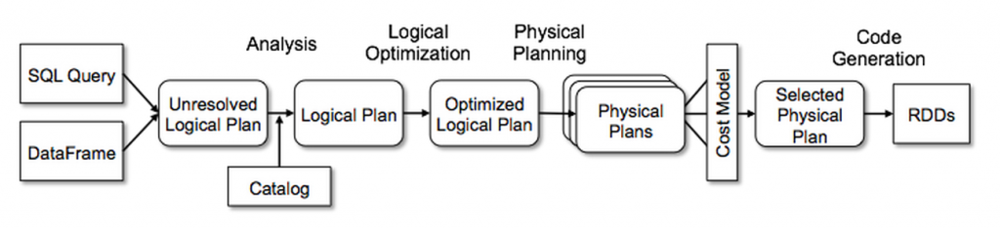

# Introduction 
goals : 
- deliver the motivations and business need for processing big data using distributed computing
- deliver key concepts of distributed computing 

___
Pengenalan big data
Quality of big data : 
- Volume : size of the data stored 
- Velocity : speed for processing the data
- Variety : data types
- Veracity : data quality / integrity 

Masalah : Jabarkan masalah dari 4v 

Solusi : Spark - 

## Apa itu Spark 
Origin : Spark dibuat di UC Berkeley, 2009 oleh Matei Zaharia (co-founder databricks)
Tujuan Diciptakan : 
- Fast, general purpose system 
- Distributes computations accross machines 
Backers : >1000 Developer, >2000 Companies, 

Spark is not a database. It's a computational engine that can read from databases. 

## Kenapa Spark 
Spark menggabungkan banyak tools kedalam sebuah sistem yang sama, memudahkan user utk mengintegrasikan platform big data yang dimiliki. 
Sebelum spark, tools tools yang beredar berdiri secara mandiri utk menyelesaikan permasalahan 4v. 
### Spark support banyak bahasa :
- Scala
- Java
- Python
- R
- SQL

### Spark dapat membaca dan memproses data dari banyak sumber :
- Database
- BLOB
- Data Warehouse
- CSV

### Motivational Example : How Spark Works
For motivational exmaple on how spark works, consider you are given a task to count a tons of m&ms (m&m is a candy). 
How would you actually do that ? 

solution 1 : sampling the weight of few m&ms then project it to predict the number of m&ms given the total weights. 
Answer : it's might not be right, since m&ms has different size and weight. Doing this will not answer how many "Exactly" m&ms is there. When we are working with data, percistency matters. 

Solution 2: ask for friends 
Yes! it is a good choice to involve the others to help you counts the number of m&ms. 

But now here comes the next questions. "How do you aggregate all the counted m&ms" among your friends ? 

Solution 1 : Adding up yourself 
Answer : No! in spark, we don't do that
In Spark terminology, you are the driver, and your friends are the executors/worker. As driver, you need work as less as possible. 
So, what you will do, is, delegate one of your friends to add up the counts from the other friends. And this is how spark works. 

See this illustrations of how driver and worker are related

Funfact : 
Adding more worker/executor, doesn't guarantee the task will be done faster. 
**Why more computing power isn't always faster??**
Think about it. If you are given only a small bag of m&ms that contains 200pcs, and you invite 100 friends with you, you will lose time for communication : 
- Giving each of your 100 friends a very few m&ms (20 pcs)
- Having one of your friend add up those small numbers of counted m&ms
In this case, you better of inviting only a few friends that counts larger quantity of m&ms. 

Alternatively, if its a very small bag of m&ms, you might not even need any distributed computation at all. 

To understand more about this, take a look at ahmdal's law saying that the amount of acceleration we would see from paralellizing a task is a function of what portion of the task can be completed in parallel.

Later in this class we will learn about computational slots that each worker has and the concept of paralellism and scalability.

To summarize, these are two considerations when to use spark
- If you want to scale out 
You need to scale out if you have too much data to process in a single machine 
- If you want to Speed up
More computer resource may speed up the query 

___

# Spark DataFrame
Now that we all familiar with the concept of spark, on how the driver and workers doing, let's now talk about the core concept of spark architecture, the Spark DataFrame. 

goals :
- Distinguish RDD and Spark DataFrame

## Evolution of Spark 
### Resilient Distributed Datasets (RDD)
On its early stage of development, spark uses Resilient Distributed Datasets which later often called as an RDD. 

By its name, RDD is **resilient** meaning that it's **fault tolerant**. For example, given 20 workers working on your query, the worker #10 is having an error and did not completed the task leading to incomplete final result. 

Using RDD, you don't need to restart the work using 20 worker,  you need only worker #10 to restart the task and making the final result complete. 

### DataFrame
On its later stage, Spark implements DataFrame API to operate with DataFrame. DataFrame inherits the behaviour of RDD. It's distributed and resilient. But it has more component, the **metadata**. The metadate enables sparks to optimize the dataframe better than RDD. It can know what datatypes stored for each columns of the data, how much columns does it has, etc. 

Here's a graph showing that using DataFrame API will benefits more than RDDs ([source](https://disruptivetechasean.com/wp-content/uploads/RDDs-DataFrames-and-Datasets-in-Apache-Spark.pdf))

From the graph above, it's shown that regardless of the language (SQL, R, Python, Scala), the dataframe perfomrs better than the RDD. 

The secret behind such performance is **spark catalyst**. The catalyst will automatically figure out how the execution will be done, what can be improved, what order of queries could be changed. This picture will show how a query is executed.

From the graph above, any query will be converted into logical plan, then the catalyst evaluate to optimizer the plan and transform it into physical plan. 

The analogy of this is when you are using a map application and setting up a direction from point A to point B, you specify **what** you want to do, then the map app figure out the **how** using optimized calculation and gives you the best route. 

